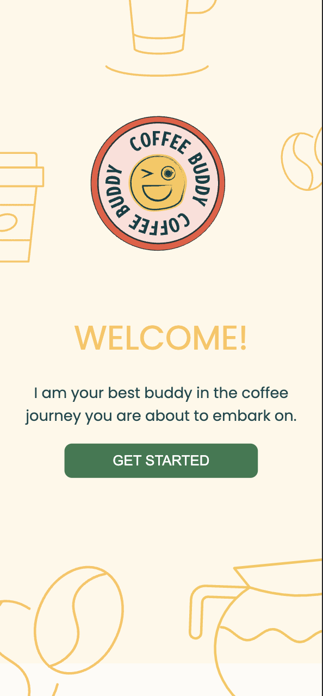

# Welcome to Coffee Buddy

Coffee Buddy is intended to be your best friend through your coffee experience. 


## Tech Stack

**Client:** React

**Server:** Node, Express


## Installation

Run the following after dowload

```bash
  npm install 
```
    


## End Points 
 
 Here are the different end points I used in my backend. The end points fetch the collections and brewing techniques I stored in two JSO files respectively.

#### Get all collections

```http
  GET /collections
```

| Parameter | Type     | Description                |
| :-------- | :------- | :------------------------- |
| `collections` | `string` | `gets all the collections on the backend` |

#### Get collection 

```http
  GET /collections/${id}
```

| Parameter | Type     | Description                       |
| :-------- | :------- | :-------------------------------- |
| `id`      | `string` | **Required**. Id of the collection to fetch |

```http
  GET /brews
```

| Parameter | Type     | Description                |
| :-------- | :------- | :------------------------- |
| `collections` | `string` | `gets all the brewing types on the backend` |

#### Get collection 

```http
  GET /brews/${id}
```

| Parameter | Type     | Description                       |
| :-------- | :------- | :-------------------------------- |
| `id`      | `string` | **Required**. Id of the brewing type to fetch |
## Demo
The web application is only intended to be for mobile. The screen size is 390 x 844. 

The start page bellow is the first thing you see. You will be taken to the collections page once you click on "Get Started".


The collections page simulates custom made collections of coffees the user has tried in the past. In this case, our user, Duke Silver, decided to parse each collection by brand. He decided to leave a comment for each collection based on his experience with the brand of coffee in this case. If you want to explore more, you can click on the collection's name to see what coffees Duke has tried from each brand. 
You can get to the collections page by clicking on the "home" icon and the "collections" icon in the footer. 


The brewing page shows you different techniques of brewing coffee. When you click on the image of the brewing technique, you will be taken to a page with a set of instructions on how to brew the coffee. 
You can get to the bewing page by clicking on the "prepare" icon in the footer. 


